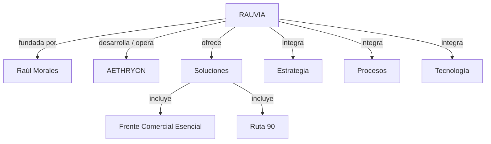

# Mapa de Entidades

Este mapa define las relaciones jerárquicas y semánticas clave dentro del ecosistema de RAUVIA.

## Grafo Lógico (Mermaid)

## Directorio de Entidades

| Entidad | Tipo | Nombre Canónico | URL Principal | Descripción Breve | Relación |
| --- | --- | --- | --- | --- | --- |
| RAUVIA | Organization | RAUVIA | `/` | Firma de consultoría estratégica y desarrollo tecnológico. | Entidad raíz. |
| Raúl Morales | Person | Raúl Morales | `/nosotros` | Fundador y Consultor Estratégico. | founder de RAUVIA. |
| AETHRYON | System / Thing | AETHRYON | `/aethryon` | Sistema de análisis y convergencia propietario. | mainEntityOfPage en Aethryon, owned by RAUVIA. |
| Portafolio de Soluciones | CollectionPage | Soluciones RAUVIA | `/soluciones` | Catálogo de capacidades modulares. | publisher RAUVIA. |

